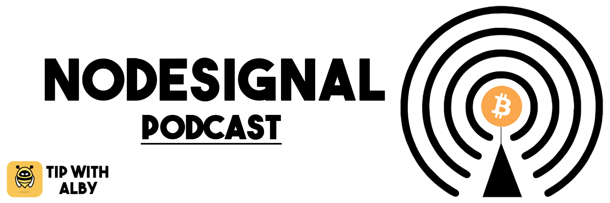
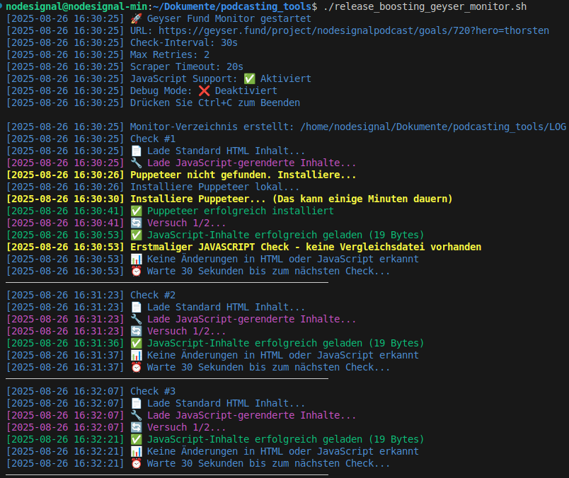

# 

### [Nodesignal](https://nodesignal.space) - A Podcast that is dedicated to the bitcoin and podcasting 2.0 community. ###

In this Repository you will find some usefill scripts for the following use cases:
 - A bash script to check the goals of our [Geyser.fund project page](https://geyser.fund/project/nodesignalpodcast/goals) and adjust the release of our episodes depended of the current donation amount over the [PodHome API](https://serve.podhome.fm/api/docs/). Also know as Nodesignal Release Boosting.
 - A Telegram Bot that reuse the information of the previous shell script and let the listener check the roadmap of the upcoming episodes with description, current donation amount of the assigned goal on Geyser and the release date. (Coming soon....) 
 - Some Scripts to extract the latest episode of the RSS-feed, create a video of it and upload it to Youtube. (Coming soon....) 

## Release Boosting Geyser Monitor

### Required Software

- Your favourite Linux distro (developed and tested on LinuxMint)
- npm

### Environment setup

    # install node.js and other dependencies
    $ sudo apt install npm

    # clone the repository to your local machine and enter the directory
    $ git clone https://github.com/nodesignal-podcast/podcasting_tools.git
    $ cd podcasting_tools/

    # copy and adjust the config file with your parameters, details in the file
    $ cp geyser_monitor_config.conf.example geyser_monitor_config.conf
    $ nano geyser_monitor_config.conf
    
    # make the shell script executeable and run it
    $ chmod +x release_boosting_geyser_monitor.sh
    $./release_boosting_geyser_monitor.sh

If everything it configured correctly your will the the following console output

# 
## Telgram Bot (Coming soon....) 

## RSS2Video2YouTube-Converter (Coming soon....) 

## Support us
